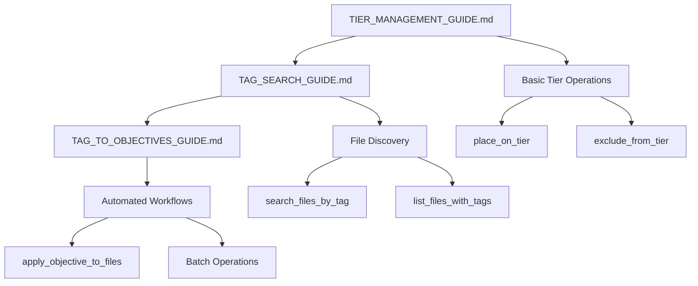

# 📚 **Volume Canvas MCP Server - Complete Guides Index**

## **Overview**

This index provides a comprehensive overview of all available guides for the Volume Canvas MCP Server with NVIDIA AI Q Toolkit integration. Each guide focuses on specific aspects of the system to help you master tier management and data organization.

---

## **📋 Available Guides**

### **🔍 1. Tag Search Guide**
**File**: `docs/TAG_SEARCH_GUIDE.md`

**Purpose**: Comprehensive guide for searching files using tags

**Key Topics**:
- Understanding tags and tag structure
- Tag search tools and syntax
- Search patterns and examples
- Advanced search techniques
- Best practices and troubleshooting

**Use When**: You need to find files based on metadata tags

**Quick Start**:
```json
{
  "tool": "search_files_by_tag",
  "arguments": {
    "tag_name": "user.priority",
    "tag_value": "high"
  }
}
```

---

### **🎯 2. Tag Search to Objectives Guide**
**File**: `docs/TAG_TO_OBJECTIVES_GUIDE.md`

**Purpose**: Complete workflow for using tag searches to apply tier objectives

**Key Topics**:
- Step-by-step tag-to-objectives process
- Complete workflow examples
- Advanced multi-criteria workflows
- Best practices for automation
- Troubleshooting common issues

**Use When**: You want to automatically apply objectives to files found by tag search

**Quick Start**:
```bash
# 1. Search for files
search_files_by_tag({"tag_name": "user.priority", "tag_value": "high"})

# 2. Apply objective to results
apply_objective_to_files({
  "file_paths": ["/path1", "/path2"],
  "objective_type": "place_on_tier",
  "tier_name": "tier0"
})
```

---

### **🏆 3. Tier Management Guide**
**File**: `docs/TIER_MANAGEMENT_GUIDE.md`

**Purpose**: Complete guide for managing data movement between storage tiers

**Key Topics**:
- Understanding storage tiers (Tier 0, 1, 2, Archive)
- Moving data into and out of Tier 0
- Complete workflow examples
- Best practices and troubleshooting
- Quick start commands

**Use When**: You need to move folders or files between storage tiers

**Quick Start**:
```bash
# Move folder to Tier 0
place_on_tier("/path/to/folder", "tier0")

# Move folder from Tier 0
exclude_from_tier("/path/to/folder", "tier0")
```

---

## **🚀 Getting Started Paths**

### **🆕 For New Users**
1. **Start Here**: `TIER_MANAGEMENT_GUIDE.md` - Learn the basics of tier management
2. **Next**: `TAG_SEARCH_GUIDE.md` - Learn how to find files using tags
3. **Advanced**: `TAG_TO_OBJECTIVES_GUIDE.md` - Automate tier management with tags

### **🔍 For Tag-Based Workflows**
1. **Start Here**: `TAG_SEARCH_GUIDE.md` - Master tag searching
2. **Next**: `TAG_TO_OBJECTIVES_GUIDE.md` - Apply objectives to search results
3. **Reference**: `TIER_MANAGEMENT_GUIDE.md` - Understand tier concepts

### **🎯 For Tier Management**
1. **Start Here**: `TIER_MANAGEMENT_GUIDE.md` - Learn tier management basics
2. **Next**: `TAG_SEARCH_GUIDE.md` - Use tags to organize data
3. **Advanced**: `TAG_TO_OBJECTIVES_GUIDE.md` - Automate with tag-based workflows

---

## **📖 Guide Relationships**



---

## **🛠️ Available Tools Reference**

### **🔍 Search Tools**
- **`search_files_by_tag`** - Find files by tag criteria
- **`list_files_with_tags`** - List files with their tags
- **`list_files`** - List files in a directory

### **🏷️ Tagging Tools**
- **`set_file_tag`** - Add or update tags on files

### **🎯 Objective Tools**
- **`place_on_tier`** - Move data TO a specific tier
- **`exclude_from_tier`** - Move data FROM a specific tier
- **`apply_objective_to_files`** - Apply objectives to multiple files

### **📊 Monitoring Tools**
- **`list_jobs`** - Monitor data movement jobs
- **`get_system_status`** - Check system health

---

## **📁 Demo Scripts**

### **🧪 Test Scripts**
- **`scripts/test_extended_features.py`** - Test all MCP server features
- **`scripts/tag_to_objectives_demo.py`** - Demonstrate tag-to-objectives workflows

### **🚀 Server Scripts**
- **`scripts/start_aiq_mcp_server.py`** - Start the MCP server
- **`start_server.sh`** - Shell script to start server
- **`stop_server.sh`** - Shell script to stop server

---

## **🎯 Common Use Cases**

### **📁 Use Case 1: Move AI Models to Tier 0**
**Guide**: `TAG_TO_OBJECTIVES_GUIDE.md`
**Workflow**:
1. Tag models with `user.priority=high`
2. Search for high-priority files
3. Apply Tier 0 objective to results

### **📁 Use Case 2: Archive Old Data**
**Guide**: `TAG_TO_OBJECTIVES_GUIDE.md`
**Workflow**:
1. Tag old files with `user.age=old`
2. Search for old files
3. Exclude from Tier 0, place on archive

### **📁 Use Case 3: Environment-Based Management**
**Guide**: `TAG_TO_OBJECTIVES_GUIDE.md`
**Workflow**:
1. Tag files by environment (`user.env=production`)
2. Search by environment
3. Apply appropriate tier objectives

### **📁 Use Case 4: Project-Based Organization**
**Guide**: `TAG_SEARCH_GUIDE.md` + `TAG_TO_OBJECTIVES_GUIDE.md`
**Workflow**:
1. Tag files by project (`user.project=project-name`)
2. Search for project files
3. Apply project-specific tier objectives

---

## **🔧 Troubleshooting Quick Reference**

### **❌ Common Issues**

#### **No search results**
- Check tag names and values
- Use `list_files_with_tags` to discover tags
- Verify path parameters

#### **Objectives not applying**
- Check file paths are correct
- Verify tier names are valid
- Monitor job status

#### **Server not starting**
- Check NVIDIA API key configuration
- Verify Python environment
- Check system status

### **🔧 Debug Commands**
```bash
# Check system status
get_system_status()

# Discover available tags
list_files_with_tags({"path": "/", "limit": 10})

# Test basic search
search_files_by_tag({"tag_name": "user.project"})

# Monitor jobs
list_jobs({"status_filter": "all"})
```

---

## **📞 Support Resources**

### **📚 Documentation**
- **`README.md`** - Project overview and setup
- **`PROJECT_SUMMARY.md`** - Complete project summary
- **`EXTENDED_FEATURES_SUMMARY.md`** - Feature overview

### **🧪 Testing**
- **`scripts/test_extended_features.py`** - Test all features
- **`scripts/tag_to_objectives_demo.py`** - Workflow demos

### **⚙️ Configuration**
- **`.env`** - Environment variables (NVIDIA API key)
- **`requirements.txt`** - Python dependencies
- **`config/`** - Configuration files

---

## **🚀 Quick Start Checklist**

### **✅ Setup**
- [ ] NVIDIA API key configured
- [ ] Python environment activated
- [ ] MCP server started
- [ ] System status verified

### **✅ Basic Operations**
- [ ] List files with tags
- [ ] Search files by tag
- [ ] Set tags on files
- [ ] Apply objectives to files

### **✅ Advanced Workflows**
- [ ] Tag-based file discovery
- [ ] Batch objective application
- [ ] Job monitoring
- [ ] Automated workflows

---

## **🎯 Next Steps**

1. **Choose Your Path**: Select the appropriate guide based on your needs
2. **Follow Examples**: Use the provided examples as starting points
3. **Test Workflows**: Run the demo scripts to see features in action
4. **Build Automation**: Create your own tag-based workflows
5. **Monitor Results**: Use job monitoring to track progress

**🎉 Happy Tier Managing!** These guides should help you master the Volume Canvas MCP Server for efficient data management and tier operations.
